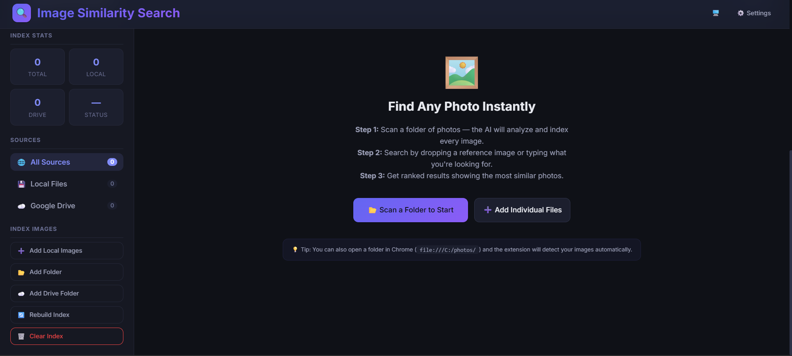
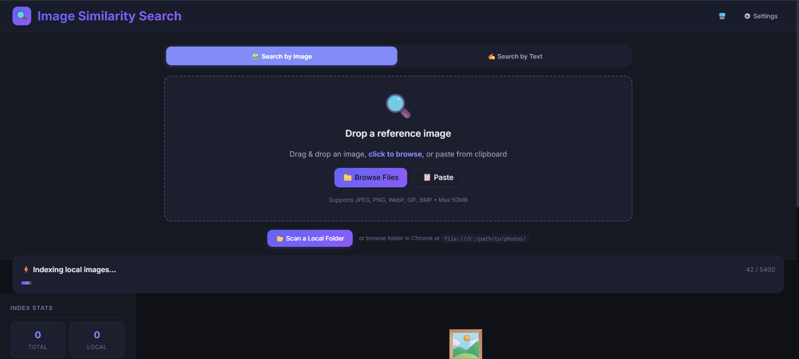

# Image Similarity Search — Chrome Extension

> AI-powered image search for your local photo collections. Find any photo instantly by dropping a reference image or typing what you're looking for — powered by on-device MobileNet AI.




## ✨ Key Features

### 🔍 Dual Search Modes
- **Search by Image** — Drop a reference photo to find visually similar matches using AI embeddings
- **Search by Text** — Type what you're looking for (e.g. *"dog"*, *"car"*, *"mountain"*) and AI-detected tags find matching photos

### 📂 Smart Folder Indexing
- **One-Click Folder Scan** — Select any folder from the dashboard and index all images automatically
- **Browser Folder Detection** — Open a local folder in Chrome (`file:///C:/photos/`) and the extension auto-detects images and shows a floating panel to index them
- **Batch Processing** — Handles thousands of photos with progress tracking, GPU memory management, and duplicate detection



### 🧠 AI-Powered Analysis
- **Visual Embeddings** — 1024-dimensional MobileNet V2 feature vectors for accurate visual similarity
- **Auto-Classification** — Each image is classified with ImageNet labels (e.g. "golden retriever", "sports car", "lakeside") for text search
- **On-Device Processing** — All AI inference runs locally in your browser via TensorFlow.js (WebGL accelerated)

### 🛠️ Additional Features
- **🖱️ Right-Click Search** — Right-click any image on the web → "Search similar images"
- **📋 Clipboard Paste** — Paste images directly from clipboard to search
- **☁️ Google Drive Integration** — Connect Google Drive and index cloud images
- **🌗 Theme Support** — Light / Dark / System with smooth transitions
- **🔒 100% Private** — Zero data leaves your browser. No servers, no uploads, no tracking.

---

## 📖 How to Use the Extension

### 1. Installation

1. Download or clone this repository and run `npm install` and `npm run build` to generate the extension files.
2. Open Chrome (or Edge/Brave) and navigate to `chrome://extensions/`.
3. Enable **Developer mode** using the toggle in the top-right corner.
4. Click **"Load unpacked"** and select the `dist/` folder generated in step 1.
5. **Important**: Click **"Details"** on the newly installed extension and enable **"Allow access to file URLs"**. This is required for the extension to scan your local folders!

### 2. Indexing Your Photos

Before you can search, the AI needs to index your photos. There are two ways to do this:

**Method A: From the Dashboard**
1. Click the extension icon in your toolbar and select **"Open Dashboard"**.
2. Click the **"📂 Scan a Folder to Start"** button.
3. Select the folder on your computer containing your photos.
4. The extension will scan the folder, process each image through the AI model, and save the metadata to your browser's local database.

**Method B: Browser Auto-Detection**
1. Open a new tab in Chrome and paste the path to your photos folder directly into the URL bar (e.g., `file:///C:/Users/YourName/Pictures/`).
2. The extension will automatically detect that you are viewing a local folder and inject a floating ImgSearch panel.
3. Click **"⚡ Index All"** on the panel to begin indexing everything in that folder.

### 3. Searching

Once your images are indexed, you can search them in three ways:

- **Text Search**: Open the dashboard, click the "✍️ Search by Text" tab, and type what you are looking for (e.g., "dog", "beach", "car"). The AI will match your query against the tags it generated during indexing.
- **Image Search**: Open the dashboard, click the "🖼️ Search by Image" tab, and drag & drop a reference photo. The AI will find photos in your collection that look visually similar.
- **Right-Click Search**: Find an image on any website, right-click it, and select **"Search similar images"**. The extension will open the dashboard and find matches from your local collection!

---

## 🧠 Detailed Architecture: How It Works

This extension operates entirely locally within your browser. No images are ever uploaded to a server. Here is a technical breakdown of how it achieves lightning-fast semantic and visual search:

```
┌─────────────┐     ┌──────────────┐     ┌──────────────┐
│  Your Photo  │────▸│  MobileNet   │────▸│  1024-dim    │
│  Collection  │     │  V2 Model    │     │  Embedding   │
└─────────────┘     └──────────────┘     └──────┬───────┘
                                                 │
                    ┌──────────────┐              │ Store
                    │  IndexedDB   │◂─────────────┘
                    │  (Dexie.js)  │
                    └──────┬───────┘
                           │ Compare
┌─────────────┐     ┌──────▾───────┐     ┌──────────────┐
│ Query Image  │────▸│   Cosine     │────▸│   Ranked     │
│ or Text      │     │  Similarity  │     │   Results    │
└─────────────┘     └──────────────┘     └──────────────┘
```

### 1. The AI Model (MobileNet V2)
The core of the extension is powered by **TensorFlow.js** and **MobileNet V2**, a highly efficient convolutional neural network optimized to run in the browser using WebGL (GPU acceleration). 
- When the extension loads, it downloads the model weights (~14MB) and caches them in the browser.
- The model acts as both a **feature extractor** (for visual similarity) and an **image classifier** (for text search).

### 2. The Indexing Pipeline
When you select a folder to scan, the extension reads the files locally and feeds them into the MobileNet model in small batches. For every image:
- **Visual Embedding**: The AI strips off the final classification layer of the neural network and extracts the "penultimate layer"—a dense array of 1024 numbers (a feature vector). This vector is a mathematical representation of the visual concepts in the image (shapes, colors, textures, objects).
- **Classification Tags**: The AI also passes the image through the final layer to predict what is in the photo, generating text labels (e.g., "golden retriever", "pickup truck").
- **Storage**: The 1024-dim vector, the text tags, and a tiny compressed thumbnail are stored persistently in the browser using **IndexedDB** (via Dexie.js).

### 3. The Search Algorithms

**Image Similarity Search (Cosine Similarity)**
When you search using a reference image, the extension calculates the 1024-dim feature vector for your query image. It then iterates through every vector stored in your IndexedDB database and calculates the **Cosine Similarity** between the query vector and the stored vectors. 
Cosine similarity measures the angle between two multi-dimensional vectors. A score close to `1.0` means the images are conceptually identical, while a lower score means they are unrelated. The results are ranked by this score and displayed instantly.

**Text Search (Fuzzy Matching)**
When you search using text, the extension compares your query against the AI-generated tags and the original filenames. 
It uses a weighted scoring system:
- **0.9 points**: Exact match with an AI tag.
- **0.7 points**: Partial/substring match with an AI tag.
- **0.6 points**: Match within the original filename.
The results are aggregated, sorted by score, and displayed to the user.

### WebGL Stability Engine
Processing thousands of images in a browser tab can exhaust GPU memory. To prevent crashes (`CONTEXT_LOST_WEBGL`), the extension implements an aggressive WebGL memory management system. It sets `WEBGL_DELETE_TEXTURE_THRESHOLD = 0` to force instant texture cleanup, manually calls `tf.engine().disposeVariables()`, yields to the browser's garbage collector via `tf.nextFrame()`, and can automatically recover and reload the model if the GPU context drops.

---

## 🔧 Development

```bash
# Start dev server with hot reload
npm run dev

# Type check
npx tsc --noEmit

# Production build
npm run build
```

## ☁️ Google Drive Setup (Optional)

Google Drive integration is **optional**. The extension works fully for local images without it.

1. Create a [Google Cloud Project](https://console.cloud.google.com/)
2. Enable **Google Drive API** and **Google Picker API**
3. Create an **OAuth 2.0 Client ID** (Chrome Extension type)
4. Update credentials in:
   ```
   src/shared/constants.ts  → GOOGLE_CLIENT_ID, GOOGLE_API_KEY
   public/manifest.json     → oauth2.client_id
   ```
5. Rebuild and reload the extension

## 📦 Tech Stack

| Layer | Technology |
|-------|-----------|
| UI | React 18 + TypeScript |
| Build | Vite + CRXJS Plugin |
| AI Model | TensorFlow.js + MobileNet V2 |
| Storage | IndexedDB (Dexie.js) |
| Auth | chrome.identity OAuth 2.0 |
| Cloud | Google Drive API v3 |
| Extension | Chrome Manifest V3 |

## ⚠️ Limitations

- **Model Size**: MobileNet weights are ~14MB, loaded on first use
- **Index Size**: Recommended max ~5,000 images (configurable in settings)
- **Text Search**: Limited to ImageNet's 1000 categories (not free-form language)
- **File URLs**: "Allow access to file URLs" must be enabled in `chrome://extensions` for folder detection
- **Browser Only**: Runs on CPU/WebGL — not GPU-optimized for very large collections

## 📄 License

MIT
